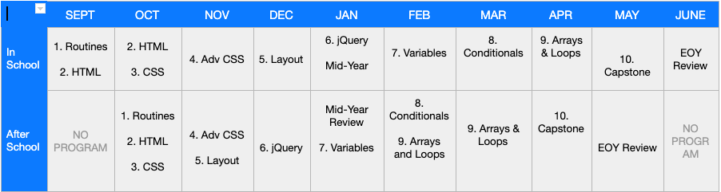

Introduction to Web Development Curriculum, 19-20
===================

<!--
Pacing Calendar (Year 1)
===================
|  Sept | Oct | Nov | Dec | Jan | Feb | March | April | May |
|:--------|:---|:---|:---|:---|:---|:---|:---|:---|:---|
|  [**0:Welcome**](units/unit1)   1: HTML   **Survey**|  2:CSS   3:HTML    4:Positioning  | 5:jQuery  6:Cloud9  7:Github | 6:Cloud9   7:Github  | 8:JavaScript   9:Types, Conditionals |  9: Types, Conditionals  10:Functions  | 11:Arrays  12:Animations | 12:Animations  13:Looping| 14:Capstone   Survey |
-->
## Pacing Calendar

## Scope and Sequence

| Unit | Overview | Objectives   *Coders will...*|
|:--------|:-------:|:---------|
| [**1: Introduction to Code Nation**](units/unit1) |3 Lessons| <ul> <li>Describe how coding is used in the world</li> <li>Navigate the Popcode coding environment</li> <li>Navigate Google Classroom</li> </ul>
| [**2: HTML**](units/unit2) |5 Lessons| <ul><li> Use correct syntax to create an an opening and a closing HTML tag.</li> <li> Use correct syntax to create simple HTML elements.</li> <li> Create HTML elements with attributes to add links to their pages. </li> <li> Create HTML elements with attributes to add images to their pages.</li> <li> Debug their code by using available resources to find and fix errors. </li></ul>
| [**3: CSS**](units/unit3) |3 Lessons  1 Project|<ul> <li>Select an HTML element and change its style using a single CSS property and value.</li> <li>Select an HTML element and change its style using multiple CSS properties and values</li> <li>Describe the difference between head and body by linking Google Fonts to style their page.</li><li>Use CSS properties and values, and Google Fonts to style a profile page. (Group Project)</li> </ul>
| [**4: Advanced CSS**](units/unit4) |2 Lessons 1 Project 1 Review Lesson|<ul> <li>Use class attributes and selectors to style specific groups of elements on the page</li> <li>Use multiple class attributes to apply specific styling to elements on the page</li> <li>Use class selectors and class attributes to style an awards website.</li><li>Review all objectives covered from units 1-4</li> </ul>
| [**5: Layout and Positioning**](units/unit5) |3 Lessons 1 Project|  <ul> <li>Using divs to organize elements on a page</li><li>Use box model (padding, border, and margin) to manipulate the spacing of elements on a page.</li><li>Use flexbox to align elements on a webpage.</li><li>Create a webpage on someone who inspires you</li></ul>
| [**6: jQuery**](units/unit6) |4 Lessons 1 Project|<ul><li>Use jQuery to select, show, and hide HTML elements</li><li>Use jQuery actions to make HTML elements toggle, slide, and fade</li><li>Use jQuery actions that take one or more arguments, such as .text(), and .css(), when a button is clicked</li><li>Write event handlers that allow the page to respond when a user interacts with it</li><li>Use jQuery actions to build an interactive website</li></ul>
| [**Mid-Year Unit: Hackathon**](units/midyear) |6 Lessons|<ul><li>Enagage in collaborative brainstorming, use a wireframe to plan a webpage.</li><li>Collaborate with team members on a shared project</li><li>Understand how to export projects to a sharable online porfolio</li><li>Develop skills to properly prepare for a presentation</li><li>Complete the Mid-Survey and review HTML, CSS, and jQuery concepts</li></ul>
| [**7: Introduction to Javascript**](units/unit7) |5 Lessons 1 Project|<ul><li>Define a program language and identify ways that javascript can be used in a website</li><li>Create a new variable, store information in it, and read its value.</li><li>Identify strings and numbers as data types and differentiate between them.use operators to manipulate data.</li><li>Use input.val( ) to retrieve a value from an input field.</li><li>Use .append() and string interpolation to add an element to the screen.</li><li>Create a website that stores user input, manipulates the input and displays output.</li></ul>
| [**8: Conditionals**](units/unit8) |3 Lessons  1 Project|  <ul><li>Create basic conditional statements.</li><li>Create conditional statements with multiple conditions using else-if.</li> <li>Identify, evaluate, and construct compound conditional statements</li><li>Create a website that uses conditional statements to control program flow</li></ul>
| [**9: Arrays and Loops**](units/unit9) |3 Lessons 1 Project  1 Review Lesson|<ul><li>Create an array and retrieve an array element using the index.</li><li>Create for of loops in JavaScript in order to iterate over an array.</li> <li>Add elements to an array by using .push() and get the number of elements in the array by using .length .</li> <li>Create a website that uses loops to iterate over arrays</li><li>Review all objectives covered from units 7-9</li></ul>
| [**10: Capstone Project**](units/unit10) |5 Lessons |  <ul><li>Enagage in collabortive brainstorming, use a wireframe to plan a webpage.</li><li>Collaborate with team members on a shared project.</li><li>Understand how to export projects to a sharable online porfolio.</li><li>Develop skills to properly prepare for a presentation.</li></ul>
| [**EOY Unit**](units/EOY_Review_Unit) |2 Lessons |<ul><li>Complete an end-of-year survey to reflect on their Code Nation experience and share feedback. Demonstrate their technical mastery through and End of year assessment</li><li>Celebrate their technical mastery and showcase exemplar projects.</li></ul>
----

<h3 align="center"><a href="https://docs.google.com/forms/d/e/1FAIpQLSfiZv1Y0U4Fr5k2iFVWRIVg2x7Su-r1hLoH0qb5RCMlNsxUjQ/viewform">Submit Your Feedback</a></h3>

----
## School Teacher Resources

* [CodeNation Teacher Liaison Curriculum Guide 19-20](https://docs.google.com/document/d/1IisBQOGlbDj1QBxcGtKrL-E5gZXhoUiumWlvkNHz8yg/edit): To be used in the Code Nation courses that are co-taught with a teacher from the school.

----

**Curriculum content contributed by**: 
Allie Jones, 
Andrew Ingraham, 
Elizabeth Dowd, 
Gilbert Ghang, 
Jenna Van Conett, 
Matthew A. Brown, 
Matthew Gerrior, 
Mark Griffith, 
Ramata Williams, 
Sayri Suarez, 
Simon Lesser, 
Sophat Sam, 
Vanessa Dean, 
Zainab Ebrahimi, 
Bridget Bailey, 
Elizabeth Dielentheis, 
Gracie Elqura, 
Kevin Dou, 
Marina Bichoffe, 
Pratik Pramanik, 
Razzi Abuissa, 
Roan Kattouw, 
Traci Lopez, 
Xavi Ramirez
 

 

 
 
Our curriculum is licensed under a <a rel="license" href="http://creativecommons.org/licenses/by-nc/4.0/">Creative Commons Attribution-NonCommercial 4.0 International License</a>.

